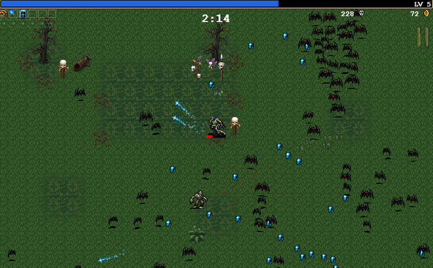
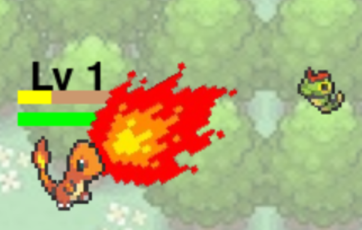

# Pokemon Survivor

Pokemon Survivor는 Vampire Survivors와 같은 뱀서라이크 게임입니다.


## 뱀서라이크 게임이란?

로그라이크 장르의 특징을 가지고 있는 탑뷰 또는 쿼터뷰 시점의 게임으로서

슈팅 요소를 포함한 여러 무기를 조합해 적을 쓰러트려야 합니다. (예 : Vampire Survivors)




## 시작하기

### pip install

```python 
pip install pygame
```


## 프로그램 시작

필요한 모듈과 위 파일들을 모두 다운로드 받았다면

pokemon_survivor_main.py 파일을 IDLE로 열어 F5를 눌러 실행합니다


## 게임 설명

Pokemon Survivor는 가여운 파이리가 아주 흉악한 캐터피와 피죤투들이 몰려오는 것을 막는 게임입니다.

WASD로 파이리를 움직일 수 있으며, 파이리의 모든 공격은 가장 가까운 대상을 향해 발사합니다.

3분이 지나면 게임에서 승리한것으로 간주합니다.


## 화면 설명

### 세이브 슬롯 화면

비어있는 슬롯을 선택해 새로 게임을 플레이할 수 있습니다.

데이터가 남아있는 슬롯을 선택해 이어서 게임을 플레이할 수 있습니다.

json 파일을 삭제해 세이브파일을 삭제할 수 있습니다.


### 메인 화면

시작 버튼을 눌러 게임을 시작합니다.

강화 버튼을 눌러 초기 능력을 강화합니다

저장 버튼을 눌러 현재 상황을 세이브 슬롯에 저장합니다.

종료 버튼을 눌러 세이브 슬롯 화면으로 돌아갑니다.


#### 메인-강화 화면

게임이 종료되면 스코어의 10%에 해당하는 골드를 획득합니다.

강화를 눌러 골드를 소모하고 능력을 강화할 수 있습니다.


### 게임 화면

상단 좌측엔 점수, 중앙엔 경과 시간이 나타납니다.

초록색/빨간색으로 현재/최대체력을, 노란색/연갈색으로 경험치 현황을 나타나며 위에는 레벨이 표시됩니다.


#### 게임-강화 선택 화면

파이리의 경험치가 가득 차면 레벨업을 합니다.

아쉽게도 리자드나 리자몽으로 진화하진 않습니다.


랜덤으로 주어지는 3개의 선택지 중 하나를 30초 내로 골라 이번 게임동안 능력을 강화합니다.


## 핵심 코드 및 기능 설명

### 1.파이리의 이동과 공격

유저가 마지막으로 누른 키보드 A/D에 따라 파이리가 왼쪽/오른쪽을 바라봅니다.

```python
    def update(self, keys, enemies=None):
        if keys[pygame.K_w] and self.rect.top > 0:
            self.rect.y -= self.speed
        if keys[pygame.K_s] and self.rect.bottom < HEIGHT:
            self.rect.y += self.speed
        if keys[pygame.K_a] and self.rect.left > 0:
            self.rect.x -= self.speed
            self.facing_right = False
        if keys[pygame.K_d] and self.rect.right < WIDTH:
            self.rect.x += self.speed
            self.facing_right = True

        self.update_image_orientation()
        if enemies:
            self.update_projectiles(enemies)

    def update_image_orientation(self):
        if self.facing_right:
            self.image = pygame.transform.flip(
                pygame.transform.scale(PLAYER_IMAGE, (45, 45)), True, False
            )
        else:
            self.image = pygame.transform.scale(PLAYER_IMAGE, (45, 45))
```

불꽃세례(Ember)는 가장 가까운 적의 방향으로 부채꼴 형태의 공격을 합니다.

```python
    def attack(self, enemies):
        if time.time() - self.last_attack_time < 1:
            return

        closest_enemies = self.find_closest_enemies(enemies, 1)
        if closest_enemies:
            closest_enemy = closest_enemies[0]
            dx = closest_enemy.rect.centerx - self.rect.centerx
            dy = closest_enemy.rect.centery - self.rect.centery
            self.target_angle = math.degrees(math.atan2(dy, dx))

            for enemy in enemies:
                dx = enemy.rect.centerx - self.rect.centerx
                dy = enemy.rect.centery - self.rect.centery
                distance = math.sqrt(dx**2 + dy**2)
                if distance <= self.attack_range:
                    angle = math.degrees(math.atan2(dy, dx)) - self.target_angle
                    angle = abs((angle + 180) % 360 - 180)
                    if angle <= self.attack_angle:
                        enemy.health -= self.attack_damage

            self.last_attack_time = time.time()
            self.show_attack_time = time.time()
```



화염구(Fireball)는 첫번째로, 두번재로... 가까운 적의 방향으로 화면 가장자리에서 사라지는 투사체를 발사합니다.

투사체의 개수는 투사체 개수 증가 레벨에 따라 증가합니다.

```python
    def secondary_attack(self, enemies):
        if not self.secondary_attack_enabled:
            return

        if time.time() - self.secondary_attack_last_time < 5:
            return

        closest_enemies = self.find_closest_enemies(enemies, self.projectile_count_level + 1)
        for enemy in closest_enemies:
            dx = enemy.rect.centerx - self.rect.centerx
            dy = enemy.rect.centery - self.rect.centery
            angle = math.atan2(dy, dx)
            self.create_projectile(self.rect.centerx, self.rect.centery, angle)

        self.secondary_attack_last_time = time.time()

    def create_projectile(self, x, y, angle):
        base_size = 50
        size = int(base_size * (1.2 ** (self.secondary_attack_level // 2)))

        image = pygame.transform.scale(ATTACK_EFFECT2_IMAGE, (size, size))
        rect = image.get_rect(center=(x, y))
        speed = 4
        damage = 50 * (1.2 ** ((self.secondary_attack_level + 1) // 2))

        projectile = pygame.sprite.Sprite()
        projectile.image = image
        projectile.rect = rect
        projectile.angle = angle
        projectile.speed = speed
        projectile.damage = damage
        projectile.hit_enemies = set()  # 타격한 적을 기록할 집합

        self.projectiles.add(projectile)


    def update_projectiles(self, enemies):
        for projectile in list(self.projectiles):
            # 화염구 이동
            projectile.rect.x += math.cos(projectile.angle) * projectile.speed
            projectile.rect.y += math.sin(projectile.angle) * projectile.speed

            # 화면 밖으로 나가면 제거
            if (
                projectile.rect.right < 0
                or projectile.rect.left > WIDTH
                or projectile.rect.bottom < 0
                or projectile.rect.top > HEIGHT
            ):
                self.projectiles.remove(projectile)

            # 적과의 충돌 감지
            for enemy in enemies:
                if (
                    projectile.rect.colliderect(enemy.rect) and
                    enemy not in projectile.hit_enemies  # 이미 타격한 적은 제외
                ):
                    enemy.health -= projectile.damage
                    projectile.hit_enemies.add(enemy)  # 적을 타격한 적 목록에 추가
```


가장 가까운 적 추적 코드

```python
    def find_closest_enemies(self, enemies, count):
        distances = [
            (enemy, math.sqrt((self.rect.centerx - enemy.rect.centerx) ** 2 +
                              (self.rect.centery - enemy.rect.centery) ** 2))
            for enemy in enemies
        ]
        distances.sort(key=lambda x: x[1])
        return [enemy for enemy, _ in distances[:count]]
```

### 2.적의 이동과 공격

적은 맵 좌우 가장자리에서 랜덤하게 스폰되며, 스폰되는 순간부터 파이리를 위협하러 다가옵니다.

```python
        if random.random() < 0.03:
            enemy = Enemy(enemy_health, enemy_image)
            enemies.add(enemy)
            all_sprites.add(enemy)
```

```python
    def update(self, player_pos):
        dx = player_pos[0] - self.rect.centerx
        dy = player_pos[1] - self.rect.centery
        distance = math.sqrt(dx**2 + dy**2)
```

30초마다 체력이 증가되며, 1분 30초에는 캐터피가 피죤투로 대체되며 배경이 바뀝니다.

```python
    while running:
        elapsed_time = time.time() - start_time

        # 체력 변화
        if elapsed_time >= 30 and elapsed_time < 60:
            enemy_health = 75
        elif elapsed_time >= 60 and elapsed_time < 90:
            enemy_health = 100
        elif elapsed_time >= 120 and elapsed_time < 150:
            enemy_health = 150
        elif elapsed_time >= 150 and elapsed_time < 180:
            enemy_health = 200

        # 1분 30초에 배경 및 적 이미지 변경
        if elapsed_time >= 90 and not background_changed:
            fade_out(screen)  # 페이드 아웃
            background_image = pygame.image.load("assets/background2.png")  # 배경 변경
            enemy_image = pygame.image.load("assets/enemy2.png")  # 적 이미지 변경
            enemy_health = 125  # 적 체력 변경
            fade_in(screen, background_image)  # 페이드 인
            background_changed = True  # 변경 완료 플래그
```

파이리에게 닿으면 데미지를 입히고 사라집니다.

```python
        collided_enemies = pygame.sprite.spritecollide(player, enemies, False)
        for enemy in collided_enemies:
            player.health -= enemy.damage
            enemy.kill()
            if player.health <= 0:
                running = False
```

### 3.파이리의 레벨업과 능력 강화

파이리는 1레벨부터 시작해서 30레벨까지 레벨업을 할 수 있으며, 간단한 수식으로 경험치 테이블을 생성했습니다.

```python
    def calculate_required_exp(self):
        if self.level <= 10:
            return (self.level * 5) + 10
        elif self.level <= 20:
            return (self.level * 5) + 25
        else:
            return (self.level * 5) + 50

    def add_exp(self, amount, screen, captured_screen):
        self.current_exp += amount
        while self.current_exp >= self.required_exp and self.level < 30:
            self.current_exp -= self.required_exp
            self.level += 1
            self.required_exp = self.calculate_required_exp()
            print(f"레벨 업! 현재 레벨: {self.level}")

            # 레벨 업 시 선택지 화면 호출
            handle_level_up(self, screen, captured_screen)
```

파이리가 레벨업하면 8개의 능력치중 랜덤으로 나오는 3개의 선택지에서 하나를 고를 수 있습니다.

```python
#레벨업
def handle_level_up(player, screen, captured_screen):
    running = True
    selected = None
    start_time = time.time()

    # 선택지 랜덤화
    options = ["Attack increase", "Health increase", "Speed increase", "Attack range increase",
               "Health regeneration increase", "Projectile_increase", "Ember", "Fireball"]
    chosen_options = random.sample(options, 3)

    selected_upgrades = {}  # 선택한 업그레이드를 저장

    while running:
        blend_with_white(screen, captured_screen)  # 혼합 배경 표시

        # 선택지 표시
        for i, option in enumerate(chosen_options):
            create_button(option, WIDTH // 2 - 200, 200 + i * 100, 400, 70, GRAY, BLACK)

        # 남은 시간 표시
        elapsed_time = time.time() - start_time
        remaining_time = max(30 - elapsed_time, 0)
        time_bar_width = int((remaining_time / 30) * 400)
        pygame.draw.rect(screen, (255, 255, 0), (WIDTH // 2 - 200, 150, time_bar_width, 20))

        # 이벤트 처리
        for event in pygame.event.get():
            if event.type == pygame.QUIT:
                pygame.quit()
                sys.exit()
            if event.type == pygame.MOUSEBUTTONDOWN and event.button == 1:
                pos = event.pos
                for i, option in enumerate(chosen_options):
                    if pygame.Rect(WIDTH // 2 - 200, 200 + i * 100, 400, 70).collidepoint(pos):
                        selected = option
                        selected_upgrades[option] = selected_upgrades.get(option, 0) + 1
                        running = False

        # 자동 선택 (30초 초과 시)
        if remaining_time <= 0:
            selected = chosen_options[0]
            selected_upgrades[selected] = selected_upgrades.get(selected, 0) + 1
            running = False

        pygame.display.flip()

    # 선택한 옵션 적용
    apply_level_up_choice(player, selected)

    # 선택한 업그레이드 정보 전달
    draw_selected_upgrades(screen, player)

#강화 선택지
def apply_level_up_choice(player, choice):
    """선택한 옵션에 따라 플레이어 능력치 변경"""
    if choice == "Ember":
        if player.primary_attack_level < 6:
            player.primary_attack_level += 1
            player.attack_damage *= 1.2 if player.primary_attack_level % 2 == 0 else 1
            player.attack_range *= 1.2 if player.primary_attack_level % 2 == 1 else 1
    elif choice == "Attack increase":
        if player.attack_level < 6:
            player.attack_damage += 5
            player.attack_level += 1
    elif choice == "Health increase":
        if player.health_level < 6:
            player.max_health += 5
            player.health_level += 1
    elif choice == "Speed increase":
        if player.speed_level < 6:
            player.speed += 0.1
            player.speed_level += 1
    elif choice == "Attack range increase":
        if player.attack_range_level < 6:
            player.attack_range += 20
            player.attack_range_level += 1
    elif choice == "Health regeneration increase":
        pass  # 체력 재생 로직은 이미 자동으로 적용됨
    elif choice == "Projectile_increase":
        if player.projectile_count_level < 3:
            player.projectile_count_level += 1
    elif choice == "Fireball":
        if not player.secondary_attack_enabled:
            player.enable_secondary_attack()  # 두 번째 공격 활성화
            player.secondary_attack_level += 1
        elif player.secondary_attack_level < 6:
            player.secondary_attack_level += 1
```

현재 능력 강화 상태는 좌측 하단에 아이콘으로 표시됩니다.


```python
#강화 상태
def draw_selected_upgrades(screen, player):
    ICON_SIZE = 40  # 정사각형 아이콘 크기
    PADDING = 10    # 아이콘 간 간격
    START_X = 10    # 좌측 시작 X 좌표
    START_Y = HEIGHT - (ICON_SIZE + 10)  # 하단 시작 Y 좌표

    # 작은 폰트 정의
    small_font = pygame.font.Font(None, 16)

    # 플레이어 속성과 매핑된 업그레이드 데이터 정의
    upgrades = {
        "A": player.attack_level,
        "H": player.health_level,
        "S": player.speed_level,
        "R": player.attack_range_level,
        "HR": player.health_regen_level,
        "P": player.projectile_count_level,
        "F": player.secondary_attack_level,
        "E": player.primary_attack_level,
    }

    # 아이콘 이미지 매핑
    icons = {
        "E": ATTACK_EFFECT_IMAGE,    # 불꽃세례 이미지
        "F": ATTACK_EFFECT2_IMAGE    # 화염구 이미지
    }

     # 아이콘과 레벨 표시
    for index, (key, level) in enumerate(upgrades.items()):
        x = START_X + index * (ICON_SIZE + PADDING)

        # 아이콘 배경 그리기
        pygame.draw.rect(screen, (200, 200, 200), (x, START_Y, ICON_SIZE, ICON_SIZE))

        # 아이콘 표시
        if key in icons:  # 이미지로 표시
            icon_image = pygame.transform.scale(icons[key], (ICON_SIZE, ICON_SIZE))
            screen.blit(icon_image, (x, START_Y))
        else:  # 텍스트로 표시
            icon_text = font.render(key, True, BLACK)
            text_rect = icon_text.get_rect(center=(x + ICON_SIZE // 2, START_Y + ICON_SIZE // 2))
            screen.blit(icon_text, text_rect)

        # 레벨 표시 (작은 폰트 사용)
        level_text = small_font.render(str(level), True, BLACK)
        # 오른쪽 아래 끝으로 위치 설정
        level_rect = level_text.get_rect(bottomright=(x + ICON_SIZE - 2, START_Y + ICON_SIZE - 2))
        screen.blit(level_text, level_rect)
        screen.blit(level_text, level_rect)
```

## 개발환경 및 실행환경

Python 3.12(Window 10), Python IDLE 사용
